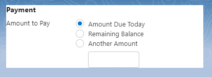
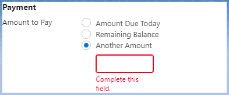
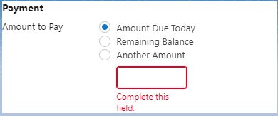
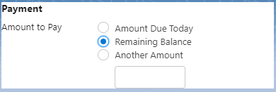

# LWC Custom Validation Issue

Issue is a result of using custom validation on an <b>lightning-input</b> that is tied to a selection in a <b>lightning-radio-group</b>.

## Issue at hand

The initial state of the component:

Place cursor into the another amount lightning-input.

Custom validation is triggered and the field is displayed as required.

Select a different lightning-radio-group option that does not make the lightning-input field required.

Input field <i>still shows</i> the custom validation message.

Select another lightning-radio-group option that does not make the lightning-input required.

The custom validation message for the input finally disappears.

